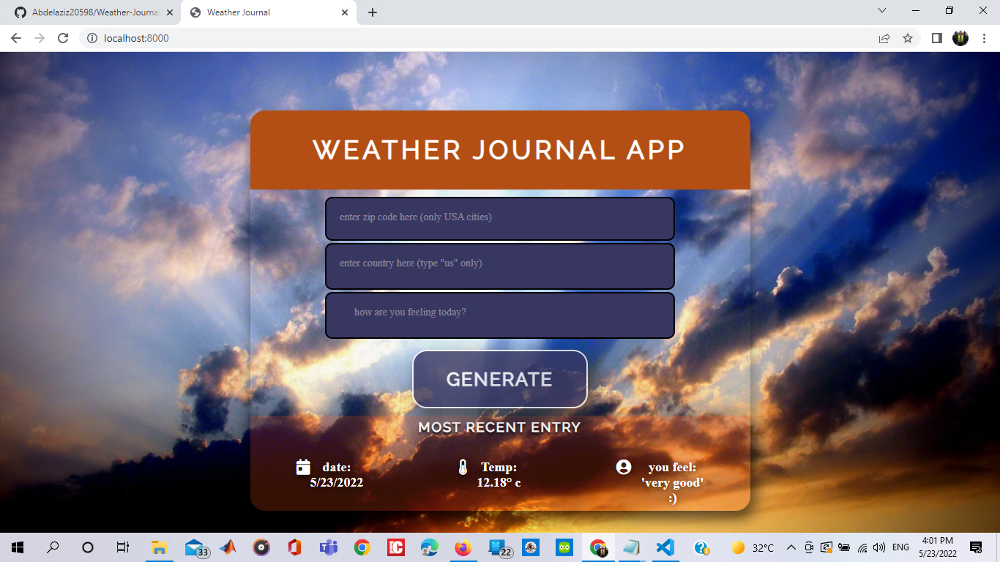
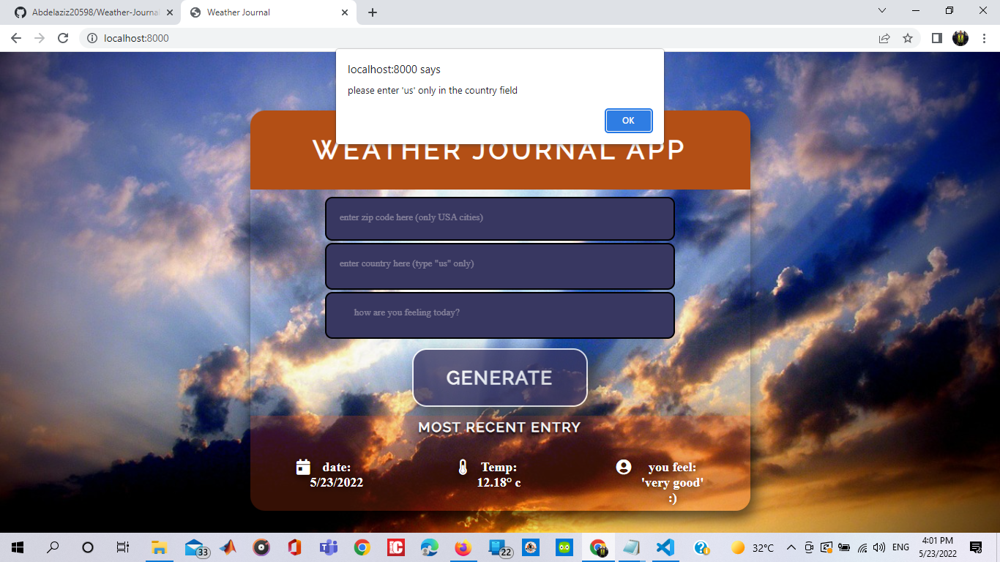

# Hi there this is my Weather-Journal App project from Udacity 
This project requires you to create an asynchronous web app that uses Web API and user data to dynamically update the UI for a Weather-Journal App.
 

## Table of Contents

#Project Environment Setup

1- Node and Express Environment:
	
Node and Express should be installed on the local machine. The project file server.js should require express(), and should create an instance of their app using express.

The Express app instance should be pointed to the project folder with .html, .css, and .js files.

2- Project Dependencies:
	
The ‘cors’ package should be installed in the project from the command line, required in the project file server.js, and the instance of the app should be setup to use cors().

The body-parser package should be installed and included in the project.

3- Local Server:
	
Local server should be running and producing feedback to the Command Line through a working callback function.

API Credentials
	

Create API credentials on OpenWeatherMap.com

    Note: The following line of code should be at the top of the app.js file:

    // Personal API Key for OpenWeatherMap API
    const apiKey = '<your_api_key>&units=imperial';

        The actual API key itself will be different for everyone.
        Notice the last part ‘&units=imperial’-- this should be included in the saved variable.

*********************************************************
#APIs and Routes

1- APP API Endpoint:
	
There should be a JavaScript Object named projectData initiated in the file server.js to act as the app API endpoint.

    Tip: Near the top of the file server.js there should be a line of code that creates an empty JavaScript object:

    projectData = {
    }

2- Integrating OpenWeatherMap API:
	
The personal API Key for OpenWeatherMap API is saved in a named const variable.
The API Key variable is passed as a parameter to fetch().
Data is successfully returned from the external API.

In the file app.js, there should be a line of code near the top:

// Personal API Key for OpenWeatherMap API
const apiKey = '<your_api_key>&units=celsius';

    Note: The personal API key must be stored in a const variable.

3- Return Endpoint Data && GET Route I: Server Side:
	
There should be a GET route setup on the server side with the first argument as a string naming the route, and the second argument a callback function to return the JS object created at the top of server code.

4- Return Endpoint Data && GET Route II: Client Side:
	
There should be an asynchronous function to fetch the data from the app endpoint

POST Route
	

You should be able to add an entry to the project endpoint using a POST route setup on the server side and executed on the client side as an asynchronous function.

The client side function should take two arguments, the URL to make a POST to, and an object holding the data to POST.

The server side function should create a new entry in the apps endpoint (the named JS object) consisting of the data received from the client side POST.

    Tip:

        Implement async calling by the use of promise chaining where you will pass the the mix of API and user responses, to POST endpoint on server side.
        The POST route in the server side should setup which will map the data sent via the API from the client side and save it in the projectData variable.
***********************************************************

#Dynamic UI

1- Naming HTML Inputs and Buttons For Interaction
	
The input element with the placeholder property set to “enter zip code here” should have an id of zip.

The textarea included in project HTML should have an id of feelings.

The button included in project HTML should have an id of generate.

2- Assigning Element Properties Dynamically:
	
The div with the id, entryHolder should have three child divs with the ids:

    date
    temp
    content

3- Event Listeners:
	
Adds an event listener to an existing HTML button from DOM using Vanilla JS.

In the file app.js, the element with the id of generate should have an addEventListener() method called on it, with click as the first parameter, and a named callback function as the second parameter.

4- Dynamically Update UI:
	
Sets the properties of existing HTML elements from the DOM using Vanilla JavaScript.

Included in the async function to retrieve that app’s data on the client side, existing DOM elements should have their innerHTML properties dynamically set according to data returned by the app route.

    Note:
    Function to GET Project Data:

    const retrieveData = async () =>{
     const request = await fetch('/all');
     try {
     // Transform into JSON
     const allData = await request.json()
     console.log(allData)
     // Write updated data to DOM elements
     document.getElementById('temp').innerHTML = Math.round(allData.temp)+ 'degrees';
     document.getElementById('content').innerHTML = allData.feel;
     document.getElementById(""date"").innerHTML =allData.date;
     }
     catch(error) {
       console.log(""error"", error);
       // appropriately handle the error
     }
    }

 
# Project Files
You can obtain the project code here. To complete the project will mostly require modifying the js/app.js file, as well as modifications to the index.html and css/styles.css files to further update and customize your project.
 
when entering zip code correctly and the country is "us"

 

when entering any country except us it will desplay a warnning 

[css file](Weather-Journal_App_Udacity/website/style.css)
[js file](Weather-Journal_App_Udacity/website/app.js)

